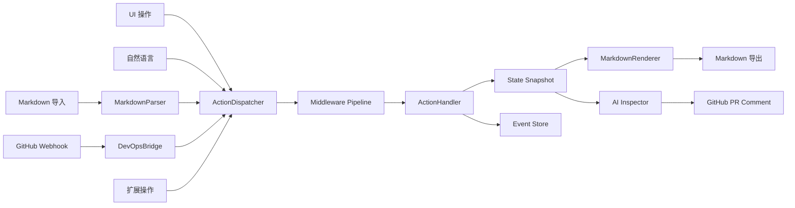
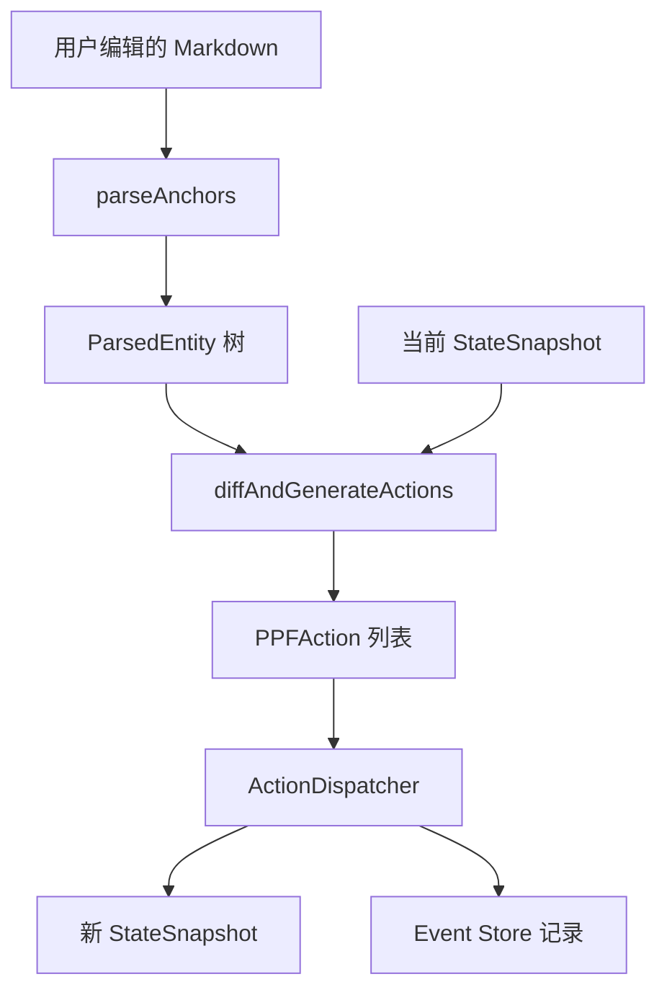
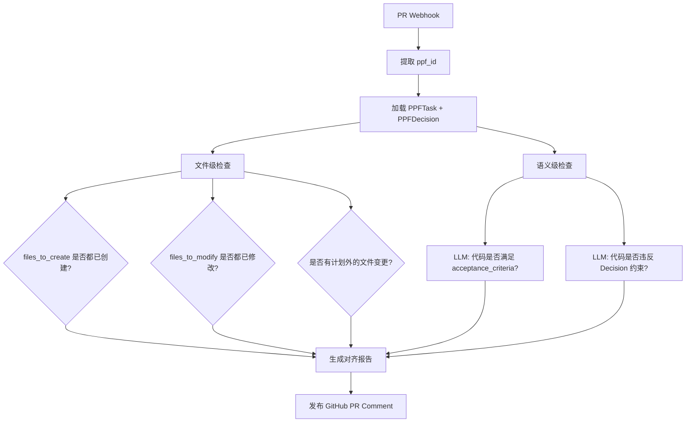

# TmPlan PPF 2.0 架构设计规范

> 版本：2.0-draft | 日期：2026-02-27 | 状态：设计阶段

## 目录

1. [概述与背景](#概述与背景)
2. [模块 1：PPF 核心数据格式](#模块-1ppf-核心数据格式)
3. [模块 2：Action Protocol](#模块-2action-protocol)
4. [模块 3：Event Sourcing](#模块-3event-sourcing)
5. [模块 4：Markdown 双向同步](#模块-4markdown-双向同步)
6. [模块 5：Extension Sandbox](#模块-5extension-sandbox)
7. [模块 6：DevOps Bridge](#模块-6devops-bridge)
8. [模块 7：AI Inspector 三向对齐](#模块-7ai-inspector-三向对齐)
9. [实施阶段路线图](#实施阶段路线图)
10. [验证场景](#验证场景)
11. [目录结构变更](#目录结构变更)

---

## 概述与背景

### 现状

TmPlan 是基于 **Next.js 16 + Tauri 2.x + Zustand 5 + Zod 4** 的项目管理工具。当前架构特征：

- 存储层：`.tmplan/` 目录下的 YAML 文件（project.yaml, modules/*.yaml, decisions/*.yaml, phases/*.yaml, status.yaml）
- AI 引导：4 阶段对话式引导（concept -> features -> ui-pages -> tech-impl）
- Markdown 导入：纯 LLM 解析，无 AST 结构化处理
- 类型系统：`types/tmplan.ts` 定义 Zod schema，schema_version 1.0
- 平台抽象：`lib/platform.ts` + `lib/tmplan/data-access.ts` 实现 Tauri/Web 双模式
- 无版本控制、无事件溯源、无扩展机制、无 Webhook 集成

### 现有类型（v1.0）

| 类型 | 文件 | 说明 |
|------|------|------|
| `ProjectConfig` | types/tmplan.ts | 项目配置（name, tech_stack, schema_version） |
| `ModulePlan` | types/tmplan.ts | 模块计划（slug, tasks, depends_on, priority） |
| `ModuleTask` | types/tmplan.ts | 任务（id, status, files_to_create/modify） |
| `Decision` | types/tmplan.ts | 决策记录（decision_id, options, chosen） |
| `PhaseConfig` | types/tmplan.ts | 阶段配置（phase, order, modules） |
| `ProjectStatus` | types/tmplan.ts | 项目状态（progress, conflicts） |
| `Conflict` | types/tmplan.ts | 冲突记录（type, severity） |

### PPF 2.0 目标

PPF（Project Plan Format）2.0 解决五大核心场景：

1. **Markdown 双向同步** — 导出带锚点的 Markdown，编辑后精确导入回 PPF
2. **自然语言操作** — 用户用自然语言修改计划，通过 Action Protocol 统一处理
3. **扩展沙箱** — 第三方扩展注入自定义字段（如敏捷开发的 story_points）
4. **版本控制** — 事件溯源记录所有变更，支持 diff 查看和一键回滚
5. **DevOps 集成** — GitHub Webhook 接收 PR 事件，AI Inspector 自动对齐检查

### 整体架构图

```
┌─────────────────────────────────────────────────────────────────┐
│                        输入源 (Input Sources)                     │
├──────────┬──────────┬──────────┬──────────┬─────────────────────┤
│   UI     │   NLP    │ Markdown │ Webhook  │    Extension        │
│  操作    │ 自然语言  │  导入    │  事件    │     扩展            │
└────┬─────┴────┬─────┴────┬─────┴────┬─────┴──────┬──────────────┘
     │          │          │          │            │
     ▼          ▼          ▼          ▼            ▼
┌─────────────────────────────────────────────────────────────────┐
│                    Action Protocol Layer                         │
│  ┌──────────────┐  ┌───────────────┐  ┌──────────────────────┐  │
│  │ ActionContext │  │  Middleware    │  │  ActionDispatcher    │  │
│  │ (source,     │  │  Pipeline     │  │  (validate ->        │  │
│  │  actor,      │  │  (ext hooks)  │  │   dispatch ->        │  │
│  │  timestamp)  │  │               │  │   apply)             │  │
│  └──────────────┘  └───────────────┘  └──────────────────────┘  │
└──────────────────────────────┬──────────────────────────────────┘
                               │
                    ┌──────────▼──────────┐
                    │   apply(action,     │
                    │     snapshot)       │
                    │   -> newSnapshot    │
                    └──────────┬──────────┘
                               │
              ┌────────────────┼────────────────┐
              ▼                ▼                ▼
┌──────────────────┐ ┌─────────────────┐ ┌──────────────────┐
│  State Files     │ │  Event Store    │ │  Extension        │
│  (.tmplan/*.yaml)│ │  (events/       │ │  Registry         │
│                  │ │   YYYY-MM-DD    │ │  (extensions      │
│  project.yaml    │ │   .yaml)        │ │   字段注入)       │
│  modules/*.yaml  │ │                 │ │                   │
│  decisions/*.yaml│ │  JSON Patch     │ │  agile-dev        │
│  status.yaml     │ │  diff 记录      │ │  custom-ext       │
└──────────────────┘ └─────────────────┘ └──────────────────┘
              │                                    │
              ▼                                    ▼
┌──────────────────┐                  ┌──────────────────────┐
│  Markdown Sync   │                  │  DevOps Bridge       │
│  (remark + AST)  │                  │  (GitHub Webhook)    │
│                  │                  │                      │
│  PPF -> MD       │                  │  PR -> Task 关联     │
│  MD -> PPF       │                  │  AI Inspector        │
│  锚点匹配        │                  │  三向对齐            │
└──────────────────┘                  └──────────────────────┘
```

### 数据流总览



---

## 模块 1：PPF 核心数据格式

### 职责

定义 PPF 2.0 的完整数据模型，为所有上层模块提供类型基础。每个实体携带全局唯一 `ppf_id` 和 `extensions` 扩展沙箱入口，实现锚点追踪和扩展数据注入。

### 文件路径

- 类型定义：`apps/web/types/ppf.ts`
- 迁移逻辑：`apps/web/lib/ppf/migrate.ts`

### 依赖关系

- 依赖：`zod`（schema 校验）、`nanoid`（ID 生成）
- 被依赖：所有其他 PPF 模块

### ppf_id 规范

```
格式：ppf_{nanoid(12)}
示例：ppf_V1StGXR8_Z5j
用途：Markdown 锚点引用、事件溯源关联、跨模块引用
```

### v1.0 -> v2.0 字段映射

| v1.0 字段 | v2.0 字段 | 变更说明 |
|-----------|-----------|---------|
| `schema_version: "1.0"` | `schema_version: "2.0"` | 版本升级 |
| — | `ppf_id` | 新增，所有实体必备 |
| — | `extensions` | 新增，扩展沙箱入口 |
| `ModuleTask.id` (如 `user-auth-01`) | `PPFTask.ppf_id` + `PPFTask.legacy_id` | ppf_id 为主键，legacy_id 保留旧 ID |
| `Decision.decision_id` (number) | `PPFDecision.ppf_id` + `PPFDecision.decision_number` | ppf_id 为主键 |
| `PhaseConfig.order` | `PPFPhase.order` | 保留 |
| `ProjectConfig.tech_stack` | `PPFProject.tech_stack` | 保留 |
| `ModulePlan.layer` | `PPFModule.layer` | 保留 |
| `ModulePlan.estimated_hours` | `PPFModule.estimated_hours` | 保留 |
| `Conflict` | `PPFConflict`（独立实体） | 增加 ppf_id，引用改为 ppf_id |

### 完整 Zod Schema

```typescript
// types/ppf.ts
import { z } from "zod";

// ============================================================
// 公共类型
// ============================================================

/** PPF ID 格式：ppf_ + 12位 nanoid */
const PPFIdSchema = z.string().regex(/^ppf_[A-Za-z0-9_-]{12}$/);

/** 扩展数据沙箱 */
const ExtensionsSchema = z.record(z.string(), z.unknown()).default({});

/** 通用状态枚举 */
const ModuleStatusSchema = z.enum(["pending", "in_progress", "completed"]);
const TaskStatusSchema = z.enum(["pending", "in_progress", "completed", "blocked"]);
const PrioritySchema = z.enum(["low", "medium", "high", "critical"]);
const SeveritySchema = z.enum(["info", "warning", "error"]);
const ConflictTypeSchema = z.enum(["deviation", "missing", "extra"]);

// ============================================================
// PPFTask — 任务
// ============================================================

export const PPFTaskSchema = z.object({
  ppf_id: PPFIdSchema,
  legacy_id: z.string().optional(),           // 兼容 v1.0 的 id（如 user-auth-01）
  title: z.string().min(1),
  status: TaskStatusSchema.default("pending"),
  depends_on: z.array(PPFIdSchema).default([]),  // 引用其他 PPFTask 的 ppf_id
  detail: z.string().default(""),
  files_to_create: z.array(z.string()).default([]),
  files_to_modify: z.array(z.string()).default([]),
  acceptance_criteria: z.array(z.string()).default([]),
  extensions: ExtensionsSchema,
});
export type PPFTask = z.infer<typeof PPFTaskSchema>;

// ============================================================
// PPFModule — 模块
// ============================================================

export const PPFModuleSchema = z.object({
  ppf_id: PPFIdSchema,
  name: z.string().min(1),                    // 显示名称（原 module 字段）
  slug: z.string().regex(/^[a-z0-9]+(-[a-z0-9]+)*$/),
  layer: z.enum(["feature", "implementation"]).default("implementation"),
  status: ModuleStatusSchema.default("pending"),
  priority: PrioritySchema.default("medium"),
  depends_on: z.array(PPFIdSchema).default([]),  // 引用其他 PPFModule 的 ppf_id
  decision_refs: z.array(PPFIdSchema).default([]), // 引用 PPFDecision 的 ppf_id
  overview: z.string().default(""),
  estimated_hours: z.number().nullable().default(null),
  created_at: z.string().datetime(),
  updated_at: z.string().datetime(),
  tasks: z.array(PPFTaskSchema).default([]),
  extensions: ExtensionsSchema,
});
export type PPFModule = z.infer<typeof PPFModuleSchema>;

// ============================================================
// PPFDecision — 决策记录
// ============================================================

export const PPFDecisionOptionSchema = z.object({
  id: z.string(),
  label: z.string(),
  description: z.string(),
});

export const PPFDecisionSchema = z.object({
  ppf_id: PPFIdSchema,
  decision_number: z.number().int().positive(),  // 原 decision_id
  question: z.string().min(1),
  context: z.string().default(""),
  options_presented: z.array(PPFDecisionOptionSchema).default([]),
  chosen: z.string(),
  reason: z.string(),
  impact: z.array(z.string()).default([]),
  affected_modules: z.array(PPFIdSchema).default([]),
  decided_at: z.string().datetime(),
  supersedes: PPFIdSchema.nullable().default(null),
  extensions: ExtensionsSchema,
});
export type PPFDecision = z.infer<typeof PPFDecisionSchema>;

// ============================================================
// PPFPhase — 阶段
// ============================================================

export const PPFPhaseSchema = z.object({
  ppf_id: PPFIdSchema,
  name: z.string().min(1),
  slug: z.string().regex(/^[a-z0-9]+(-[a-z0-9]+)*$/),
  order: z.number().int().nonnegative(),
  description: z.string().default(""),
  modules: z.array(PPFIdSchema).default([]),
  status: ModuleStatusSchema.default("pending"),
  extensions: ExtensionsSchema,
});
export type PPFPhase = z.infer<typeof PPFPhaseSchema>;

// ============================================================
// PPFConflict — 冲突
// ============================================================

export const PPFConflictSchema = z.object({
  ppf_id: PPFIdSchema,
  module_ref: PPFIdSchema,
  task_ref: PPFIdSchema.nullable().default(null),
  type: ConflictTypeSchema,
  description: z.string(),
  expected: z.string().nullable().default(null),
  actual: z.string().nullable().default(null),
  severity: SeveritySchema.default("warning"),
  detected_at: z.string().datetime(),
  resolved: z.boolean().default(false),
  resolved_at: z.string().datetime().nullable().default(null),
  resolution: z.string().nullable().default(null),
  extensions: ExtensionsSchema,
});
export type PPFConflict = z.infer<typeof PPFConflictSchema>;

// ============================================================
// PPFProject — 项目根
// ============================================================

export const PPFProjectSchema = z.object({
  schema_version: z.literal("2.0"),
  ppf_id: PPFIdSchema,
  name: z.string().min(1),
  description: z.string().default(""),
  tech_stack: z.array(z.string()).default([]),
  created_at: z.string().datetime(),
  updated_at: z.string().datetime(),
  extensions: ExtensionsSchema,
});
export type PPFProject = z.infer<typeof PPFProjectSchema>;

// ============================================================
// PPFStatus — 项目状态
// ============================================================

export const PPFStatusSchema = z.object({
  overall_progress: z.number().min(0).max(100).default(0),
  current_phase: PPFIdSchema.nullable().default(null),
  modules_status: z.record(PPFIdSchema, ModuleStatusSchema).default({}),
  last_check_at: z.string().datetime(),
  updated_at: z.string().datetime(),
  conflicts: z.array(PPFConflictSchema).default([]),
});
export type PPFStatus = z.infer<typeof PPFStatusSchema>;

// 导出公共 schema
export { PPFIdSchema, ExtensionsSchema, ModuleStatusSchema, TaskStatusSchema };
```

### 迁移策略（migrate.ts）

```typescript
// lib/ppf/migrate.ts
import { nanoid } from "nanoid";
import type { ProjectConfig, ModulePlan, Decision, PhaseConfig } from "@/types/tmplan";
import type { PPFProject, PPFModule, PPFTask, PPFDecision, PPFPhase } from "@/types/ppf";

function ppfId(): string {
  return `ppf_${nanoid(12)}`;
}

interface MigrationContext {
  moduleSlugToId: Map<string, string>;
  taskLegacyToId: Map<string, string>;
  decisionNumToId: Map<number, string>;
  phaseSlugToId: Map<string, string>;
}

/**
 * 完整迁移入口：读取 v1.0 数据，输出 v2.0 PPF 数据。
 * 两遍处理：
 *   第一遍：为每个实体生成 ppf_id，建立映射表
 *   第二遍：将 slug/legacy_id 引用替换为 ppf_id
 */
export async function migrateV1ToV2(
  project: ProjectConfig,
  modules: ModulePlan[],
  decisions: Decision[],
  phases: PhaseConfig[]
): Promise<{
  project: PPFProject;
  modules: PPFModule[];
  decisions: PPFDecision[];
  phases: PPFPhase[];
}> {
  const ctx: MigrationContext = {
    moduleSlugToId: new Map(),
    taskLegacyToId: new Map(),
    decisionNumToId: new Map(),
    phaseSlugToId: new Map(),
  };

  // 第一遍：生成 ID + 基础迁移
  const ppfProject: PPFProject = {
    schema_version: "2.0",
    ppf_id: ppfId(),
    name: project.name,
    description: project.description,
    tech_stack: project.tech_stack,
    created_at: project.created_at,
    updated_at: new Date().toISOString(),
    extensions: {},
  };

  const ppfModules = modules.map((mod) => {
    const moduleId = ppfId();
    ctx.moduleSlugToId.set(mod.slug, moduleId);
    const tasks: PPFTask[] = mod.tasks.map((t) => {
      const taskId = ppfId();
      ctx.taskLegacyToId.set(t.id, taskId);
      return {
        ppf_id: taskId, legacy_id: t.id, title: t.title,
        status: t.status, depends_on: [], detail: t.detail,
        files_to_create: t.files_to_create ?? [],
        files_to_modify: t.files_to_modify ?? [],
        acceptance_criteria: t.acceptance_criteria, extensions: {},
      };
    });
    return {
      ppf_id: moduleId, name: mod.module, slug: mod.slug,
      layer: mod.layer ?? "implementation", status: mod.status,
      priority: mod.priority ?? "medium", depends_on: [],
      decision_refs: [], overview: mod.overview,
      estimated_hours: mod.estimated_hours ?? null,
      created_at: mod.created_at, updated_at: mod.updated_at,
      tasks, extensions: {},
    };
  });

  const ppfDecisions = decisions.map((dec) => {
    const decId = ppfId();
    ctx.decisionNumToId.set(dec.decision_id, decId);
    return {
      ppf_id: decId, decision_number: dec.decision_id,
      question: dec.question, context: dec.context,
      options_presented: dec.options_presented,
      chosen: dec.chosen, reason: dec.reason,
      impact: dec.impact ?? [], affected_modules: [],
      decided_at: dec.decided_at,
      supersedes: dec.supersedes
        ? (ctx.decisionNumToId.get(dec.supersedes) ?? null)
        : null,
      extensions: {},
    };
  });

  const ppfPhases: PPFPhase[] = phases.map((p) => {
    const phaseId = ppfId();
    ctx.phaseSlugToId.set(p.slug, phaseId);
    return {
      ppf_id: phaseId, name: p.phase, slug: p.slug,
      order: p.order, description: p.description ?? "",
      modules: p.modules
        .map((slug) => ctx.moduleSlugToId.get(slug))
        .filter(Boolean) as string[],
      status: p.status, extensions: {},
    };
  });

  // 第二遍：解析引用关系
  for (let i = 0; i < ppfModules.length; i++) {
    const v1 = modules[i];
    ppfModules[i] = {
      ...ppfModules[i],
      depends_on: v1.depends_on
        .map((s) => ctx.moduleSlugToId.get(s)).filter(Boolean) as string[],
      decision_refs: (v1.decision_refs ?? [])
        .map((n) => ctx.decisionNumToId.get(n)).filter(Boolean) as string[],
      tasks: ppfModules[i].tasks.map((task, ti) => ({
        ...task,
        depends_on: v1.tasks[ti].depends_on
          .map((id) => ctx.taskLegacyToId.get(id)).filter(Boolean) as string[],
      })),
    };
  }

  return { project: ppfProject, modules: ppfModules, decisions: ppfDecisions, phases: ppfPhases };
}
```

---

## 模块 2：Action Protocol

### 职责

统一所有对 PPF 数据的修改操作。无论来源是 UI 点击、自然语言指令、Markdown 导入还是 Webhook 事件，都必须转化为一个 `PPFAction`，经过 `ActionDispatcher` 验证、分发、执行。

### 文件路径

- 类型定义：`apps/web/types/action-protocol.ts`
- 分发器：`apps/web/lib/ppf/action-dispatcher.ts`
- 处理器：`apps/web/lib/ppf/handlers/*.ts`

### 依赖关系

- 依赖：模块 1（PPF 核心类型）
- 被依赖：模块 3（Event Sourcing）、模块 4（Markdown Sync）、模块 5（Extension）、模块 6（DevOps）

### 核心概念

```
Action = 意图描述（"我想做什么"）
Handler = 执行逻辑（"怎么做"）
Dispatcher = 路由 + 中间件管道（"谁来做 + 前后处理"）
```

### Action 类型清单

| Action Type | 说明 | Payload 关键字段 |
|-------------|------|-----------------|
| `project.update` | 更新项目信息 | `fields: Partial<PPFProject>` |
| `module.create` | 创建模块 | `name, slug, overview, ...` |
| `module.update` | 更新模块 | `ppf_id, fields: Partial<PPFModule>` |
| `module.delete` | 删除模块 | `ppf_id` |
| `module.reorder` | 调整模块顺序 | `ppf_ids: string[]` |
| `task.create` | 创建任务 | `module_ref, title, detail, ...` |
| `task.update` | 更新任务 | `ppf_id, module_ref, fields` |
| `task.delete` | 删除任务 | `ppf_id, module_ref` |
| `task.move` | 移动任务到其他模块 | `ppf_id, from_module, to_module` |
| `decision.create` | 创建决策 | `question, chosen, reason, ...` |
| `decision.update` | 更新决策 | `ppf_id, fields` |
| `phase.create` | 创建阶段 | `name, slug, order` |
| `phase.update` | 更新阶段 | `ppf_id, fields` |
| `batch` | 批量操作 | `actions: PPFAction[]` |

### 完整类型定义

```typescript
// types/action-protocol.ts
import type { PPFProject, PPFModule, PPFTask, PPFDecision, PPFPhase } from "./ppf";

// ============================================================
// Action Source — 操作来源
// ============================================================

export type ActionSource = "ui" | "nlp" | "markdown-import" | "webhook" | "extension" | "migration";

// ============================================================
// Action Context — 操作上下文
// ============================================================

export interface ActionContext {
  source: ActionSource;
  actor: string;          // 用户 ID 或 "system"
  timestamp: string;      // ISO 8601
  correlation_id?: string; // 关联 ID（如 NLP 会话 ID）
  metadata?: Record<string, unknown>;
}

// ============================================================
// Action Payloads — 各操作的载荷
// ============================================================

export interface ProjectUpdatePayload {
  fields: Partial<Omit<PPFProject, "ppf_id" | "schema_version">>;
}

export interface ModuleCreatePayload {
  name: string;
  slug: string;
  overview?: string;
  layer?: "feature" | "implementation";
  priority?: "low" | "medium" | "high" | "critical";
  depends_on?: string[];   // ppf_ids of other modules
  tasks?: Array<Omit<PPFTask, "ppf_id">>;
}

export interface ModuleUpdatePayload {
  ppf_id: string;
  fields: Partial<Omit<PPFModule, "ppf_id" | "slug" | "tasks">>;
}

export interface ModuleDeletePayload {
  ppf_id: string;
}

export interface ModuleReorderPayload {
  ppf_ids: string[];  // 新的排序
}

export interface TaskCreatePayload {
  module_ref: string;  // PPFModule.ppf_id
  title: string;
  detail?: string;
  depends_on?: string[];
  files_to_create?: string[];
  files_to_modify?: string[];
  acceptance_criteria?: string[];
}

export interface TaskUpdatePayload {
  ppf_id: string;
  module_ref: string;
  fields: Partial<Omit<PPFTask, "ppf_id">>;
}

export interface TaskDeletePayload {
  ppf_id: string;
  module_ref: string;
}

export interface TaskMovePayload {
  ppf_id: string;
  from_module: string;
  to_module: string;
}

export interface DecisionCreatePayload {
  question: string;
  context?: string;
  options_presented?: Array<{ id: string; label: string; description: string }>;
  chosen: string;
  reason: string;
  impact?: string[];
  affected_modules?: string[];
  supersedes?: string;
}

export interface DecisionUpdatePayload {
  ppf_id: string;
  fields: Partial<Omit<PPFDecision, "ppf_id" | "decision_number">>;
}

export interface PhaseCreatePayload {
  name: string;
  slug: string;
  order: number;
  description?: string;
  modules?: string[];
}

export interface PhaseUpdatePayload {
  ppf_id: string;
  fields: Partial<Omit<PPFPhase, "ppf_id" | "slug">>;
}

export interface BatchPayload {
  actions: PPFAction[];
}

// ============================================================
// PPFAction — 联合类型
// ============================================================

export type PPFAction =
  | { type: "project.update"; context: ActionContext; payload: ProjectUpdatePayload }
  | { type: "module.create"; context: ActionContext; payload: ModuleCreatePayload }
  | { type: "module.update"; context: ActionContext; payload: ModuleUpdatePayload }
  | { type: "module.delete"; context: ActionContext; payload: ModuleDeletePayload }
  | { type: "module.reorder"; context: ActionContext; payload: ModuleReorderPayload }
  | { type: "task.create"; context: ActionContext; payload: TaskCreatePayload }
  | { type: "task.update"; context: ActionContext; payload: TaskUpdatePayload }
  | { type: "task.delete"; context: ActionContext; payload: TaskDeletePayload }
  | { type: "task.move"; context: ActionContext; payload: TaskMovePayload }
  | { type: "decision.create"; context: ActionContext; payload: DecisionCreatePayload }
  | { type: "decision.update"; context: ActionContext; payload: DecisionUpdatePayload }
  | { type: "phase.create"; context: ActionContext; payload: PhaseCreatePayload }
  | { type: "phase.update"; context: ActionContext; payload: PhaseUpdatePayload }
  | { type: "batch"; context: ActionContext; payload: BatchPayload };

export type ActionType = PPFAction["type"];

// ============================================================
// Action Result — 执行结果
// ============================================================

export interface ActionResult {
  success: boolean;
  action_type: ActionType;
  affected_ids: string[];     // 被影响的 ppf_id 列表
  error?: string;
  warnings?: string[];
}

// ============================================================
// Middleware — 中间件
// ============================================================

export type ActionMiddleware = (
  action: PPFAction,
  next: () => Promise<ActionResult>
) => Promise<ActionResult>;

// ============================================================
// Action Handler — 处理器接口
// ============================================================

export interface ActionHandler<T extends PPFAction = PPFAction> {
  type: T["type"];
  validate(action: T, snapshot: StateSnapshot): string[];  // 返回错误列表
  apply(action: T, snapshot: StateSnapshot): StateSnapshot; // 纯函数，返回新快照
}

// ============================================================
// State Snapshot — 状态快照
// ============================================================

export interface StateSnapshot {
  project: PPFProject;
  modules: PPFModule[];
  decisions: PPFDecision[];
  phases: PPFPhase[];
}
```

### ActionDispatcher 核心逻辑

```typescript
// lib/ppf/action-dispatcher.ts
import type {
  PPFAction, ActionResult, ActionMiddleware,
  ActionHandler, StateSnapshot
} from "@/types/action-protocol";

export class ActionDispatcher {
  private handlers = new Map<string, ActionHandler>();
  private middlewares: ActionMiddleware[] = [];

  /** 注册处理器 */
  register(handler: ActionHandler): void {
    this.handlers.set(handler.type, handler);
  }

  /** 添加中间件（按添加顺序执行） */
  use(middleware: ActionMiddleware): void {
    this.middlewares.push(middleware);
  }

  /** 分发 Action */
  async dispatch(
    action: PPFAction,
    snapshot: StateSnapshot
  ): Promise<{ result: ActionResult; newSnapshot: StateSnapshot }> {
    // 批量操作递归处理
    if (action.type === "batch") {
      let currentSnapshot = snapshot;
      const allIds: string[] = [];
      const warnings: string[] = [];

      for (const subAction of action.payload.actions) {
        const { result, newSnapshot } = await this.dispatch(subAction, currentSnapshot);
        if (!result.success) {
          return {
            result: { ...result, affected_ids: allIds },
            newSnapshot: currentSnapshot,
          };
        }
        currentSnapshot = newSnapshot;
        allIds.push(...result.affected_ids);
        if (result.warnings) warnings.push(...result.warnings);
      }

      return {
        result: {
          success: true,
          action_type: "batch",
          affected_ids: allIds,
          warnings: warnings.length > 0 ? warnings : undefined,
        },
        newSnapshot: currentSnapshot,
      };
    }

    const handler = this.handlers.get(action.type);
    if (!handler) {
      return {
        result: {
          success: false,
          action_type: action.type,
          affected_ids: [],
          error: `No handler registered for action type: ${action.type}`,
        },
        newSnapshot: snapshot,
      };
    }

    // 构建中间件链
    const execute = async (): Promise<ActionResult> => {
      // 验证
      const errors = handler.validate(action, snapshot);
      if (errors.length > 0) {
        return {
          success: false,
          action_type: action.type,
          affected_ids: [],
          error: errors.join("; "),
        };
      }

      // 应用
      const newSnapshot = handler.apply(action, snapshot);
      snapshot = newSnapshot; // 更新闭包中的 snapshot
      return {
        success: true,
        action_type: action.type,
        affected_ids: [], // handler 负责填充
      };
    };

    // 包装中间件
    let chain = execute;
    for (let i = this.middlewares.length - 1; i >= 0; i--) {
      const mw = this.middlewares[i];
      const next = chain;
      chain = () => mw(action, next);
    }

    const result = await chain();
    return { result, newSnapshot: snapshot };
  }
}
```

### Handler 示例：module.create

```typescript
// lib/ppf/handlers/module-create.ts
import { nanoid } from "nanoid";
import type { ActionHandler, StateSnapshot } from "@/types/action-protocol";
import type { PPFModule, PPFTask } from "@/types/ppf";

type ModuleCreateAction = Extract<PPFAction, { type: "module.create" }>;

export const moduleCreateHandler: ActionHandler<ModuleCreateAction> = {
  type: "module.create",

  validate(action, snapshot) {
    const errors: string[] = [];
    const { name, slug } = action.payload;

    if (!name || name.trim().length === 0) {
      errors.push("模块名称不能为空");
    }
    if (!/^[a-z0-9]+(-[a-z0-9]+)*$/.test(slug)) {
      errors.push(`slug "${slug}" 格式无效，需为小写字母数字和连字符`);
    }
    if (snapshot.modules.some((m) => m.slug === slug)) {
      errors.push(`slug "${slug}" 已存在`);
    }
    // 验证依赖引用
    for (const dep of action.payload.depends_on ?? []) {
      if (!snapshot.modules.some((m) => m.ppf_id === dep)) {
        errors.push(`依赖模块 ${dep} 不存在`);
      }
    }
    return errors;
  },

  apply(action, snapshot) {
    const now = new Date().toISOString();
    const { name, slug, overview, layer, priority, depends_on, tasks } = action.payload;

    const ppfTasks: PPFTask[] = (tasks ?? []).map((t) => ({
      ...t,
      ppf_id: `ppf_${nanoid(12)}`,
    }));

    const newModule: PPFModule = {
      ppf_id: `ppf_${nanoid(12)}`,
      name,
      slug,
      layer: layer ?? "implementation",
      status: "pending",
      priority: priority ?? "medium",
      depends_on: depends_on ?? [],
      decision_refs: [],
      overview: overview ?? "",
      estimated_hours: null,
      created_at: now,
      updated_at: now,
      tasks: ppfTasks,
      extensions: {},
    };

    return {
      ...snapshot,
      modules: [...snapshot.modules, newModule],
    };
  },
};
```

---

## 模块 3：Event Sourcing

### 职责

记录所有通过 ActionDispatcher 执行的操作，生成不可变的事件日志。支持：
- 变更历史查看（谁在什么时候做了什么）
- 状态回滚（回到任意历史时间点）
- JSON Patch diff（精确记录每次变更的字段差异）

### 文件路径

- 类型定义：`apps/web/types/event-sourcing.ts`
- 事件存储：`apps/web/lib/ppf/event-store.ts`
- 存储目录：`.tmplan/events/YYYY-MM-DD.yaml`

### 依赖关系

- 依赖：模块 1（PPF 类型）、模块 2（Action Protocol）
- 被依赖：模块 7（AI Inspector，读取事件做对齐检查）

### 事件结构

```typescript
// types/event-sourcing.ts
import type { ActionType, ActionSource, StateSnapshot } from "./action-protocol";

// ============================================================
// JSON Patch（RFC 6902 子集）
// ============================================================

export type PatchOp =
  | { op: "add"; path: string; value: unknown }
  | { op: "remove"; path: string }
  | { op: "replace"; path: string; value: unknown; old_value?: unknown };

// ============================================================
// PPFEvent — 事件记录
// ============================================================

export interface PPFEvent {
  event_id: string;           // ppf_evt_{nanoid(12)}
  action_type: ActionType;
  source: ActionSource;
  actor: string;
  timestamp: string;          // ISO 8601
  correlation_id?: string;
  affected_ids: string[];     // 被影响的 ppf_id 列表
  patch: PatchOp[];           // JSON Patch diff
  summary: string;            // 人类可读的变更摘要
}

// ============================================================
// EventStore 接口
// ============================================================

export interface EventStoreReader {
  /** 获取指定日期范围的事件 */
  getEvents(from: string, to: string): Promise<PPFEvent[]>;

  /** 获取指定实体的所有事件 */
  getEventsByEntity(ppf_id: string): Promise<PPFEvent[]>;

  /** 获取最近 N 个事件 */
  getRecentEvents(limit: number): Promise<PPFEvent[]>;
}

export interface EventStoreWriter {
  /** 追加事件 */
  appendEvent(event: PPFEvent): Promise<void>;

  /** 批量追加 */
  appendEvents(events: PPFEvent[]): Promise<void>;
}

export interface EventStore extends EventStoreReader, EventStoreWriter {}
```

### EventStore 实现

```typescript
// lib/ppf/event-store.ts
import { nanoid } from "nanoid";
import yaml from "js-yaml";
import type { PPFEvent, EventStore, PatchOp } from "@/types/event-sourcing";
import type { PPFAction, ActionResult, StateSnapshot } from "@/types/action-protocol";

/** 生成事件 ID */
function eventId(): string {
  return `ppf_evt_${nanoid(12)}`;
}

/** 计算两个快照之间的 JSON Patch diff */
export function computePatch(
  before: StateSnapshot,
  after: StateSnapshot
): PatchOp[] {
  const patches: PatchOp[] = [];

  // 项目级别 diff
  for (const key of Object.keys(after.project) as Array<keyof typeof after.project>) {
    const oldVal = before.project[key];
    const newVal = after.project[key];
    if (JSON.stringify(oldVal) !== JSON.stringify(newVal)) {
      patches.push({
        op: "replace",
        path: `/project/${key}`,
        value: newVal,
        old_value: oldVal,
      });
    }
  }

  // 模块级别 diff（新增、删除、修改）
  const beforeIds = new Set(before.modules.map((m) => m.ppf_id));
  const afterIds = new Set(after.modules.map((m) => m.ppf_id));

  for (const mod of after.modules) {
    if (!beforeIds.has(mod.ppf_id)) {
      patches.push({ op: "add", path: `/modules/${mod.ppf_id}`, value: mod });
    }
  }
  for (const mod of before.modules) {
    if (!afterIds.has(mod.ppf_id)) {
      patches.push({ op: "remove", path: `/modules/${mod.ppf_id}` });
    }
  }
  // 字段级 diff 省略（实际实现中递归比较）

  return patches;
}

/** 生成人类可读摘要 */
function generateSummary(action: PPFAction): string {
  switch (action.type) {
    case "project.update": return "更新项目信息";
    case "module.create": return `创建模块「${action.payload.name}」`;
    case "module.update": return `更新模块 ${action.payload.ppf_id}`;
    case "module.delete": return `删除模块 ${action.payload.ppf_id}`;
    case "task.create": return `创建任务「${action.payload.title}」`;
    case "task.update": return `更新任务 ${action.payload.ppf_id}`;
    case "task.delete": return `删除任务 ${action.payload.ppf_id}`;
    case "task.move": return `移动任务 ${action.payload.ppf_id}`;
    case "decision.create": return `记录决策「${action.payload.question}」`;
    case "batch": return `批量操作（${action.payload.actions.length} 个）`;
    default: return `执行 ${action.type}`;
  }
}

/** 创建事件记录的中间件 */
export function createEventSourcingMiddleware(
  store: EventStore
) {
  return async (action: PPFAction, next: () => Promise<ActionResult>) => {
    // next() 执行后 snapshot 已更新，我们需要在执行前后各取一次快照
    // 实际实现中通过 dispatcher 传入 before/after snapshot
    const result = await next();

    if (result.success) {
      const event: PPFEvent = {
        event_id: eventId(),
        action_type: action.type,
        source: action.context.source,
        actor: action.context.actor,
        timestamp: action.context.timestamp,
        correlation_id: action.context.correlation_id,
        affected_ids: result.affected_ids,
        patch: [],  // 由 dispatcher 注入
        summary: generateSummary(action),
      };
      await store.appendEvent(event);
    }

    return result;
  };
}
```

### 存储格式

事件按日期分文件存储在 `.tmplan/events/` 目录下：

```yaml
# .tmplan/events/2026-02-27.yaml
- event_id: ppf_evt_abc123def456
  action_type: module.create
  source: ui
  actor: user-1
  timestamp: "2026-02-27T10:30:00.000Z"
  affected_ids:
    - ppf_V1StGXR8_Z5j
  patch:
    - op: add
      path: /modules/ppf_V1StGXR8_Z5j
      value:
        ppf_id: ppf_V1StGXR8_Z5j
        name: 用户认证
        slug: user-auth
        # ...
  summary: 创建模块「用户认证」

- event_id: ppf_evt_xyz789ghi012
  action_type: task.create
  source: nlp
  actor: user-1
  timestamp: "2026-02-27T10:35:00.000Z"
  correlation_id: nlp-session-42
  affected_ids:
    - ppf_A2BcDeFg_H3i
  patch:
    - op: add
      path: /modules/ppf_V1StGXR8_Z5j/tasks/ppf_A2BcDeFg_H3i
      value:
        ppf_id: ppf_A2BcDeFg_H3i
        title: 实现 JWT 登录接口
        # ...
  summary: 创建任务「实现 JWT 登录接口」
```

### 回滚机制

```typescript
/**
 * 回滚到指定事件之前的状态。
 * 原理：从初始快照开始，重放到目标事件之前的所有事件。
 * 或者：反向应用 patch（利用 old_value）。
 */
export async function rollbackTo(
  eventId: string,
  store: EventStore,
  initialSnapshot: StateSnapshot
): Promise<StateSnapshot> {
  const allEvents = await store.getRecentEvents(10000);
  const targetIdx = allEvents.findIndex((e) => e.event_id === eventId);
  if (targetIdx === -1) throw new Error(`Event ${eventId} not found`);

  // 反向应用 patch
  let snapshot = structuredClone(initialSnapshot);
  for (let i = allEvents.length - 1; i >= targetIdx; i--) {
    snapshot = reversePatch(snapshot, allEvents[i].patch);
  }
  return snapshot;
}

function reversePatch(snapshot: StateSnapshot, patches: PatchOp[]): StateSnapshot {
  // 反向遍历 patch，对每个操作执行逆操作
  const reversed = [...patches].reverse();
  let state = structuredClone(snapshot);
  for (const p of reversed) {
    switch (p.op) {
      case "add":
        // 逆操作：remove
        deleteAtPath(state, p.path);
        break;
      case "remove":
        // 逆操作：add（需要 old_value，此处简化）
        break;
      case "replace":
        if (p.old_value !== undefined) {
          setAtPath(state, p.path, p.old_value);
        }
        break;
    }
  }
  return state;
}
```

---

## 模块 4：Markdown 双向同步

### 职责

实现 PPF 数据与 Markdown 文档之间的双向转换。导出时在 Markdown 中嵌入 `ppf_id` 锚点，导入时通过锚点精确匹配回 PPF 实体，避免全量 LLM 解析。

### 文件路径

- 渲染器：`apps/web/lib/ppf/markdown/renderer.ts`
- 解析器：`apps/web/lib/ppf/markdown/parser.ts`
- Diff 引擎：`apps/web/lib/ppf/markdown/diff.ts`

### 依赖关系

- 依赖：模块 1（PPF 类型）、模块 2（Action Protocol，导入时生成 Action）
- 外部依赖：`remark`（Markdown AST 解析）、`unified`（AST 处理管道）

### 锚点格式

```markdown
<!-- ppf:ppf_V1StGXR8_Z5j -->
## 用户认证模块
<!-- /ppf:ppf_V1StGXR8_Z5j -->
```

规则：
- 每个 PPF 实体对应一对 `<!-- ppf:ID -->` ... `<!-- /ppf:ID -->` 注释标签
- 锚点不影响 Markdown 渲染（HTML 注释在大多数渲染器中不可见）
- 嵌套结构：Module 锚点包含 Task 锚点

### 导出格式示例

```markdown
<!-- ppf:ppf_PROJ_ROOT_ID -->
# 我的项目

技术栈：Next.js, Tauri, TypeScript
<!-- /ppf:ppf_PROJ_ROOT_ID -->

---

<!-- ppf:ppf_V1StGXR8_Z5j -->
## 用户认证模块

**状态**: pending | **优先级**: high | **预估**: 40h

依赖模块：数据库模块

### 概述

实现用户注册、登录、JWT 鉴权等功能。

### 任务列表

<!-- ppf:ppf_A2BcDeFg_H3i -->
- [ ] **实现 JWT 登录接口** (pending)
  - 创建文件：`src/api/auth/login.ts`
  - 修改文件：`src/middleware.ts`
  - 验收标准：
    - 支持邮箱+密码登录
    - 返回 JWT token，有效期 24h
<!-- /ppf:ppf_A2BcDeFg_H3i -->

<!-- ppf:ppf_B3CdEfGh_I4j -->
- [ ] **实现用户注册接口** (pending)
  - 创建文件：`src/api/auth/register.ts`
  - 验收标准：
    - 邮箱唯一性校验
    - 密码强度检查
<!-- /ppf:ppf_B3CdEfGh_I4j -->

<!-- /ppf:ppf_V1StGXR8_Z5j -->
```

### Renderer 核心逻辑

```typescript
// lib/ppf/markdown/renderer.ts
import type { StateSnapshot } from "@/types/action-protocol";
import type { PPFModule, PPFTask } from "@/types/ppf";

export function renderToMarkdown(snapshot: StateSnapshot): string {
  const lines: string[] = [];

  // 项目头
  lines.push(`<!-- ppf:${snapshot.project.ppf_id} -->`);
  lines.push(`# ${snapshot.project.name}`);
  lines.push('');
  if (snapshot.project.tech_stack.length > 0) {
    lines.push(`技术栈：${snapshot.project.tech_stack.join(', ')}`);
  }
  lines.push(`<!-- /ppf:${snapshot.project.ppf_id} -->`);
  lines.push('', '---', '');

  // 按阶段分组输出模块
  for (const phase of snapshot.phases) {
    lines.push(`<!-- ppf:${phase.ppf_id} -->`);
    lines.push(`## 阶段 ${phase.order + 1}：${phase.name}`);
    lines.push('');

    const phaseModules = snapshot.modules.filter(
      (m) => phase.modules.includes(m.ppf_id)
    );

    for (const mod of phaseModules) {
      lines.push(...renderModule(mod));
    }

    lines.push(`<!-- /ppf:${phase.ppf_id} -->`);
    lines.push('');
  }

  return lines.join('\n');
}

function renderModule(mod: PPFModule): string[] {
  const lines: string[] = [];
  lines.push(`<!-- ppf:${mod.ppf_id} -->`);
  lines.push(`### ${mod.name}`);
  lines.push('');
  lines.push(`**状态**: ${mod.status} | **优先级**: ${mod.priority}`);
  if (mod.estimated_hours) {
    lines.push(` | **预估**: ${mod.estimated_hours}h`);
  }
  lines.push('');
  if (mod.overview) {
    lines.push(mod.overview);
    lines.push('');
  }

  if (mod.tasks.length > 0) {
    lines.push('#### 任务');
    lines.push('');
    for (const task of mod.tasks) {
      lines.push(...renderTask(task));
    }
  }

  lines.push(`<!-- /ppf:${mod.ppf_id} -->`);
  lines.push('');
  return lines;
}

function renderTask(task: PPFTask): string[] {
  const checkbox = task.status === 'completed' ? '[x]' : '[ ]';
  const lines: string[] = [];
  lines.push(`<!-- ppf:${task.ppf_id} -->`);
  lines.push(`- ${checkbox} **${task.title}** (${task.status})`);
  if (task.files_to_create.length > 0) {
    lines.push(`  - 创建文件：${task.files_to_create.map(f => '`' + f + '`').join(', ')}`);
  }
  if (task.files_to_modify.length > 0) {
    lines.push(`  - 修改文件：${task.files_to_modify.map(f => '`' + f + '`').join(', ')}`);
  }
  if (task.acceptance_criteria.length > 0) {
    lines.push('  - 验收标准：');
    for (const c of task.acceptance_criteria) {
      lines.push(`    - ${c}`);
    }
  }
  lines.push(`<!-- /ppf:${task.ppf_id} -->`);
  return lines;
}
```

### Parser 核心逻辑

```typescript
// lib/ppf/markdown/parser.ts
import type { PPFAction, ActionContext } from "@/types/action-protocol";

interface ParsedEntity {
  ppf_id: string;
  content: string;        // 锚点内的原始 Markdown 文本
  children: ParsedEntity[];
}

const ANCHOR_OPEN = /<!--\s*ppf:(ppf_[A-Za-z0-9_-]{12})\s*-->/;
const ANCHOR_CLOSE = /<!--\s*\/ppf:(ppf_[A-Za-z0-9_-]{12})\s*-->/;

/**
 * 解析 Markdown 中的 PPF 锚点，返回实体树。
 */
export function parseAnchors(markdown: string): ParsedEntity[] {
  const lines = markdown.split('\n');
  const root: ParsedEntity[] = [];
  const stack: ParsedEntity[] = [];

  for (const line of lines) {
    const openMatch = line.match(ANCHOR_OPEN);
    const closeMatch = line.match(ANCHOR_CLOSE);

    if (openMatch) {
      const entity: ParsedEntity = {
        ppf_id: openMatch[1],
        content: '',
        children: [],
      };
      if (stack.length > 0) {
        stack[stack.length - 1].children.push(entity);
      } else {
        root.push(entity);
      }
      stack.push(entity);
    } else if (closeMatch) {
      stack.pop();
    } else if (stack.length > 0) {
      stack[stack.length - 1].content += line + '\n';
    }
  }

  return root;
}

/**
 * 对比旧快照和新解析结果，生成 Action 列表。
 * 只对有变化的实体生成 update action。
 */
export function diffAndGenerateActions(
  parsed: ParsedEntity[],
  snapshot: StateSnapshot,
  context: ActionContext
): PPFAction[] {
  const actions: PPFAction[] = [];

  for (const entity of parsed) {
    // 查找对应的 PPF 实体
    const module = snapshot.modules.find((m) => m.ppf_id === entity.ppf_id);
    if (module) {
      const changes = extractModuleChanges(entity.content, module);
      if (changes) {
        actions.push({
          type: "module.update",
          context,
          payload: { ppf_id: module.ppf_id, fields: changes },
        });
      }

      // 处理子实体（任务）
      for (const child of entity.children) {
        const task = module.tasks.find((t) => t.ppf_id === child.ppf_id);
        if (task) {
          const taskChanges = extractTaskChanges(child.content, task);
          if (taskChanges) {
            actions.push({
              type: "task.update",
              context,
              payload: {
                ppf_id: task.ppf_id,
                module_ref: module.ppf_id,
                fields: taskChanges,
              },
            });
          }
        }
      }
    }
  }

  return actions;
}
```

### Markdown 导入流程



---

## 模块 5：Extension Sandbox

### 职责

允许第三方扩展向 PPF 实体注入自定义字段，同时保证核心 schema 不被污染。扩展数据存储在每个实体的 `extensions` 字段中，按扩展 ID 命名空间隔离。

### 文件路径

- 类型定义：`apps/web/types/extension.ts`
- 注册表：`apps/web/lib/ppf/extensions/registry.ts`
- 内置扩展：`apps/web/lib/ppf/extensions/builtin/`

### 依赖关系

- 依赖：模块 1（PPF 类型，`extensions` 字段）、模块 2（Action Protocol，中间件注入）
- 被依赖：无（扩展是叶子节点）

### 扩展注册接口

```typescript
// types/extension.ts
import { z } from "zod";
import type { ActionMiddleware } from "./action-protocol";

/** 扩展元数据 */
export interface ExtensionMeta {
  id: string;              // 唯一标识，如 "agile-dev"
  name: string;            // 显示名称
  version: string;         // 语义化版本
  description: string;
  author: string;
}

/** 扩展字段定义 */
export interface ExtensionFieldDef {
  /** 字段注入的目标实体类型 */
  target: "project" | "module" | "task" | "decision" | "phase";
  /** 字段 schema（Zod） */
  schema: z.ZodType;
  /** 默认值 */
  default_value: unknown;
  /** UI 渲染提示 */
  ui_hint?: "number" | "text" | "select" | "date" | "boolean";
  /** 选项（当 ui_hint 为 select 时） */
  options?: Array<{ label: string; value: string }>;
}

/** 扩展定义 */
export interface ExtensionDefinition {
  meta: ExtensionMeta;
  fields: Record<string, ExtensionFieldDef>;
  /** 可选：Action 中间件（在 Action 执行前后注入逻辑） */
  middleware?: ActionMiddleware;
  /** 可选：自定义 Action 类型 */
  custom_actions?: string[];
}
```

### 内置扩展示例：敏捷开发

```typescript
// lib/ppf/extensions/builtin/agile-dev.ts
import { z } from "zod";
import type { ExtensionDefinition } from "@/types/extension";

export const agileDevExtension: ExtensionDefinition = {
  meta: {
    id: "agile-dev",
    name: "敏捷开发",
    version: "1.0.0",
    description: "为任务添加故事点、Sprint 分配等敏捷开发字段",
    author: "TmPlan",
  },
  fields: {
    story_points: {
      target: "task",
      schema: z.number().int().min(1).max(21).nullable(),
      default_value: null,
      ui_hint: "select",
      options: [
        { label: "1", value: "1" },
        { label: "2", value: "2" },
        { label: "3", value: "3" },
        { label: "5", value: "5" },
        { label: "8", value: "8" },
        { label: "13", value: "13" },
        { label: "21", value: "21" },
      ],
    },
    sprint: {
      target: "task",
      schema: z.string().nullable(),
      default_value: null,
      ui_hint: "text",
    },
    velocity: {
      target: "module",
      schema: z.number().min(0).nullable(),
      default_value: null,
      ui_hint: "number",
    },
  },
};
```

### 扩展数据存储示例

```yaml
# modules/user-auth.yaml (PPF 2.0)
ppf_id: ppf_V1StGXR8_Z5j
name: 用户认证
slug: user-auth
extensions:
  agile-dev:
    velocity: 24
tasks:
  - ppf_id: ppf_A2BcDeFg_H3i
    title: 实现 JWT 登录接口
    extensions:
      agile-dev:
        story_points: 5
        sprint: "Sprint 3"
```

### Extension Registry

```typescript
// lib/ppf/extensions/registry.ts
import type { ExtensionDefinition, ExtensionFieldDef } from "@/types/extension";

export class ExtensionRegistry {
  private extensions = new Map<string, ExtensionDefinition>();

  /** 注册扩展 */
  register(ext: ExtensionDefinition): void {
    if (this.extensions.has(ext.meta.id)) {
      throw new Error(`Extension "${ext.meta.id}" already registered`);
    }
    this.extensions.set(ext.meta.id, ext);
  }

  /** 获取扩展 */
  get(id: string): ExtensionDefinition | undefined {
    return this.extensions.get(id);
  }

  /** 获取所有扩展 */
  getAll(): ExtensionDefinition[] {
    return Array.from(this.extensions.values());
  }

  /** 获取指定实体类型的所有扩展字段 */
  getFieldsForTarget(
    target: ExtensionFieldDef["target"]
  ): Array<{ extId: string; fieldName: string; def: ExtensionFieldDef }> {
    const result: Array<{ extId: string; fieldName: string; def: ExtensionFieldDef }> = [];
    for (const [extId, ext] of this.extensions) {
      for (const [fieldName, def] of Object.entries(ext.fields)) {
        if (def.target === target) {
          result.push({ extId, fieldName, def });
        }
      }
    }
    return result;
  }

  /** 验证扩展数据 */
  validateExtensionData(
    extId: string,
    fieldName: string,
    value: unknown
  ): { valid: boolean; error?: string } {
    const ext = this.extensions.get(extId);
    if (!ext) return { valid: false, error: `Unknown extension: ${extId}` };
    const field = ext.fields[fieldName];
    if (!field) return { valid: false, error: `Unknown field: ${fieldName}` };
    const result = field.schema.safeParse(value);
    return result.success
      ? { valid: true }
      : { valid: false, error: result.error.message };
  }
}
```

---

## 模块 6：DevOps Bridge

### 职责

接收外部 DevOps 平台（GitHub、GitLab 等）的 Webhook 事件，将其转化为 PPF Action。核心场景：

- PR 创建/合并时，自动关联到对应的 PPFTask
- CI/CD 状态变更时，更新任务状态
- Issue 创建时，可选自动生成 PPFTask

### 文件路径

- 类型定义：`apps/web/types/devops-bridge.ts`
- Webhook 处理：`apps/web/lib/ppf/devops/webhook-handler.ts`
- 关联引擎：`apps/web/lib/ppf/devops/linker.ts`

### 依赖关系

- 依赖：模块 1（PPF 类型）、模块 2（Action Protocol）
- 被依赖：模块 7（AI Inspector，读取 PR 数据做对齐检查）

### Webhook 事件映射

| GitHub 事件 | PPF Action | 说明 |
|-------------|-----------|------|
| `pull_request.opened` | `task.update` (status -> in_progress) | PR 标题含 `[ppf:ID]` 时自动关联 |
| `pull_request.closed` (merged) | `task.update` (status -> completed) | 合并后标记任务完成 |
| `pull_request.closed` (not merged) | 无 | 仅记录事件 |
| `check_suite.completed` | `task.update` (extensions) | 更新 CI 状态到扩展字段 |
| `issues.opened` | `task.create` (可选) | Issue 标题含 `[ppf-task]` 时 |

### PR 标题关联格式

```
feat(user-auth): 实现 JWT 登录接口 [ppf:ppf_A2BcDeFg_H3i]
```

正则匹配：`\[ppf:(ppf_[A-Za-z0-9_-]{12})\]`

### Webhook Handler

```typescript
// lib/ppf/devops/webhook-handler.ts
import type { PPFAction, ActionContext } from "@/types/action-protocol";

interface GitHubPREvent {
  action: "opened" | "closed" | "synchronize" | "reopened";
  pull_request: {
    title: string;
    number: number;
    merged: boolean;
    html_url: string;
    head: { sha: string };
    changed_files: number;
    additions: number;
    deletions: number;
  };
  repository: {
    full_name: string;
  };
}

const PPF_REF_REGEX = /\[ppf:(ppf_[A-Za-z0-9_-]{12})\]/g;

export function handlePullRequestEvent(
  event: GitHubPREvent,
  context: ActionContext
): PPFAction[] {
  const actions: PPFAction[] = [];
  const refs = [...event.pull_request.title.matchAll(PPF_REF_REGEX)];

  if (refs.length === 0) return actions;

  for (const match of refs) {
    const ppfId = match[1];

    switch (event.action) {
      case "opened":
      case "reopened":
        actions.push({
          type: "task.update",
          context: { ...context, source: "webhook" },
          payload: {
            ppf_id: ppfId,
            module_ref: "", // 由 dispatcher 查找
            fields: {
              status: "in_progress",
              extensions: {
                "devops-bridge": {
                  pr_url: event.pull_request.html_url,
                  pr_number: event.pull_request.number,
                  pr_status: "open",
                  last_sha: event.pull_request.head.sha,
                },
              },
            },
          },
        });
        break;

      case "closed":
        if (event.pull_request.merged) {
          actions.push({
            type: "task.update",
            context: { ...context, source: "webhook" },
            payload: {
              ppf_id: ppfId,
              module_ref: "",
              fields: {
                status: "completed",
                extensions: {
                  "devops-bridge": {
                    pr_status: "merged",
                    merged_at: new Date().toISOString(),
                  },
                },
              },
            },
          });
        }
        break;
    }
  }

  return actions;
}
```

---

## 模块 7：AI Inspector 三向对齐

### 职责

在 PR 合并前，自动检查代码变更是否与 PPF 计划对齐。三向对齐指：

1. **PPF 计划** — 任务定义的 files_to_create/modify、acceptance_criteria
2. **PR 代码变更** — 实际修改的文件列表、代码内容
3. **项目决策** — 相关的 PPFDecision 约束

### 文件路径

- 检查引擎：`apps/web/lib/ppf/inspector/alignment-checker.ts`
- 报告生成：`apps/web/lib/ppf/inspector/report-generator.ts`
- GitHub 集成：`apps/web/lib/ppf/inspector/github-commenter.ts`

### 依赖关系

- 依赖：模块 1（PPF 类型）、模块 3（Event Store，读取变更历史）、模块 6（DevOps Bridge，获取 PR 数据）
- 外部依赖：LLM API（用于语义级对齐检查）

### 对齐检查流程



### 对齐报告格式

```typescript
// lib/ppf/inspector/alignment-checker.ts

export interface AlignmentReport {
  task_ref: string;           // PPFTask.ppf_id
  pr_number: number;
  checked_at: string;
  overall_status: "aligned" | "partial" | "misaligned";

  file_checks: {
    expected_creates: string[];
    actual_creates: string[];
    missing_creates: string[];
    expected_modifies: string[];
    actual_modifies: string[];
    missing_modifies: string[];
    unexpected_files: string[];
  };

  criteria_checks: Array<{
    criterion: string;
    status: "pass" | "fail" | "uncertain";
    evidence?: string;        // LLM 给出的判断依据
  }>;

  decision_checks: Array<{
    decision_ref: string;     // PPFDecision.ppf_id
    question: string;
    chosen: string;
    compliance: "compliant" | "violation" | "uncertain";
    detail?: string;
  }>;

  summary: string;            // 人类可读的总结
}
```

### AlignmentChecker 核心逻辑

```typescript
export async function checkAlignment(
  task: PPFTask,
  module: PPFModule,
  decisions: PPFDecision[],
  prFiles: { filename: string; status: "added" | "modified" | "removed" }[],
  llmClient: LLMClient
): Promise<AlignmentReport> {
  const now = new Date().toISOString();

  // 1. 文件级检查
  const actualCreates = prFiles
    .filter((f) => f.status === "added")
    .map((f) => f.filename);
  const actualModifies = prFiles
    .filter((f) => f.status === "modified")
    .map((f) => f.filename);

  const missingCreates = task.files_to_create.filter(
    (f) => !actualCreates.some((a) => a.endsWith(f) || a === f)
  );
  const missingModifies = task.files_to_modify.filter(
    (f) => !actualModifies.some((a) => a.endsWith(f) || a === f)
  );

  const allExpected = [...task.files_to_create, ...task.files_to_modify];
  const unexpectedFiles = [...actualCreates, ...actualModifies].filter(
    (f) => !allExpected.some((e) => f.endsWith(e) || f === e)
  );

  // 2. 语义级检查（通过 LLM）
  const criteriaChecks = await Promise.all(
    task.acceptance_criteria.map(async (criterion) => {
      const result = await llmClient.checkCriterion(criterion, prFiles);
      return {
        criterion,
        status: result.status as "pass" | "fail" | "uncertain",
        evidence: result.evidence,
      };
    })
  );

  // 3. 决策合规检查
  const relatedDecisions = decisions.filter(
    (d) => d.affected_modules.includes(module.ppf_id)
  );
  const decisionChecks = await Promise.all(
    relatedDecisions.map(async (dec) => {
      const result = await llmClient.checkDecisionCompliance(dec, prFiles);
      return {
        decision_ref: dec.ppf_id,
        question: dec.question,
        chosen: dec.chosen,
        compliance: result.compliance as "compliant" | "violation" | "uncertain",
        detail: result.detail,
      };
    })
  );

  // 4. 综合判断
  const hasFileMissing = missingCreates.length > 0 || missingModifies.length > 0;
  const hasCriteriaFail = criteriaChecks.some((c) => c.status === "fail");
  const hasViolation = decisionChecks.some((d) => d.compliance === "violation");

  let overall_status: "aligned" | "partial" | "misaligned" = "aligned";
  if (hasViolation || (hasFileMissing && hasCriteriaFail)) {
    overall_status = "misaligned";
  } else if (hasFileMissing || hasCriteriaFail) {
    overall_status = "partial";
  }

  return {
    task_ref: task.ppf_id,
    pr_number: 0, // 由调用方填充
    checked_at: now,
    overall_status,
    file_checks: {
      expected_creates: task.files_to_create,
      actual_creates: actualCreates,
      missing_creates: missingCreates,
      expected_modifies: task.files_to_modify,
      actual_modifies: actualModifies,
      missing_modifies: missingModifies,
      unexpected_files: unexpectedFiles,
    },
    criteria_checks: criteriaChecks,
    decision_checks: decisionChecks,
    summary: generateSummaryText(overall_status, missingCreates, missingModifies, criteriaChecks),
  };
}
```

### GitHub PR Comment 格式

```markdown
## 🔍 PPF 对齐检查报告

**任务**: 实现 JWT 登录接口 (`ppf_A2BcDeFg_H3i`)
**状态**: ✅ 对齐 / ⚠️ 部分对齐 / ❌ 未对齐

### 📁 文件检查

| 类型 | 预期 | 实际 | 状态 |
|------|------|------|------|
| 创建 | `src/api/auth/login.ts` | `src/api/auth/login.ts` | ✅ |
| 修改 | `src/middleware.ts` | `src/middleware.ts` | ✅ |
| 计划外 | — | `src/utils/jwt.ts` | ⚠️ |

### ✅ 验收标准

- ✅ 支持邮箱+密码登录
- ✅ 返回 JWT token，有效期 24h

### 📋 决策合规

- ✅ 决策 #3: 使用 JWT 而非 Session（合规）
```

---

## 实施阶段路线图

### Phase 1：核心基础（2-3 周）

| 任务 | 文件 | 说明 |
|------|------|------|
| 定义 PPF 2.0 类型 | `types/ppf.ts` | Zod schema，所有实体 |
| 定义 Action Protocol 类型 | `types/action-protocol.ts` | Action 联合类型 + Handler 接口 |
| 定义 Event Sourcing 类型 | `types/event-sourcing.ts` | PPFEvent + EventStore 接口 |
| 实现 ActionDispatcher | `lib/ppf/action-dispatcher.ts` | 中间件管道 + 分发逻辑 |
| 实现核心 Handlers | `lib/ppf/handlers/*.ts` | module.create/update/delete, task.* |
| 实现 v1 -> v2 迁移 | `lib/ppf/migrate.ts` | 两遍处理，ID 映射 |
| 实现 EventStore | `lib/ppf/event-store.ts` | YAML 文件存储 + JSON Patch diff |

### Phase 2：Markdown 同步（1-2 周）

| 任务 | 文件 | 说明 |
|------|------|------|
| 实现 Markdown Renderer | `lib/ppf/markdown/renderer.ts` | PPF -> Markdown（带锚点） |
| 实现 Markdown Parser | `lib/ppf/markdown/parser.ts` | 锚点解析 + 实体树构建 |
| 实现 Diff 引擎 | `lib/ppf/markdown/diff.ts` | 旧快照 vs 新解析 -> Action 列表 |
| 集成到导入流程 | `lib/tmplan/import-markdown.ts` | 替换现有 LLM-only 解析 |

### Phase 3：扩展系统（1 周）

| 任务 | 文件 | 说明 |
|------|------|------|
| 定义扩展类型 | `types/extension.ts` | ExtensionDefinition + FieldDef |
| 实现 ExtensionRegistry | `lib/ppf/extensions/registry.ts` | 注册、查询、验证 |
| 实现敏捷开发扩展 | `lib/ppf/extensions/builtin/agile-dev.ts` | story_points, sprint |
| UI 集成 | 组件层 | 动态渲染扩展字段 |

### Phase 4：DevOps + AI Inspector（2 周）

| 任务 | 文件 | 说明 |
|------|------|------|
| 定义 DevOps 类型 | `types/devops-bridge.ts` | Webhook 事件类型 |
| 实现 Webhook Handler | `lib/ppf/devops/webhook-handler.ts` | GitHub PR 事件处理 |
| 实现 Linker | `lib/ppf/devops/linker.ts` | ppf_id 关联引擎 |
| 实现 AlignmentChecker | `lib/ppf/inspector/alignment-checker.ts` | 三向对齐检查 |
| 实现 ReportGenerator | `lib/ppf/inspector/report-generator.ts` | Markdown 报告 |
| 实现 GitHub Commenter | `lib/ppf/inspector/github-commenter.ts` | PR Comment API |

### Phase 5：UI 集成 + 打磨（2 周）

| 任务 | 说明 |
|------|------|
| 事件历史面板 | 展示 Event Store 中的变更历史 |
| 回滚确认对话框 | 选择事件 -> 预览 diff -> 确认回滚 |
| Markdown 导出/导入 UI | 一键导出、拖拽导入 |
| 扩展管理面板 | 启用/禁用扩展、配置字段 |
| DevOps 设置页 | 配置 Webhook URL、关联规则 |

---

## 验证场景

### 场景 1：自然语言修改计划

```
用户输入："把用户认证模块的优先级改为 critical，并添加一个新任务'实现 OAuth2 登录'"

预期流程：
1. NLP 解析 -> 生成 batch Action：
   - module.update { ppf_id: "ppf_xxx", fields: { priority: "critical" } }
   - task.create { module_ref: "ppf_xxx", title: "实现 OAuth2 登录" }
2. ActionDispatcher 验证 + 执行
3. EventStore 记录 2 个事件
4. UI 实时更新
```

### 场景 2：Markdown 往返

```
1. 导出 Markdown（带锚点）
2. 用户在外部编辑器修改：
   - 将任务 "实现 JWT 登录接口" 的状态从 pending 改为 completed（勾选 checkbox）
   - 修改模块概述文本
3. 导入修改后的 Markdown
4. Parser 通过锚点匹配，生成 2 个 update Action
5. 只更新变化的字段，其他数据不变
```

### 场景 3：PR 对齐检查

```
1. 开发者创建 PR：feat(user-auth): 实现 JWT 登录接口 [ppf:ppf_A2BcDeFg_H3i]
2. Webhook 触发 -> task.update (status: in_progress)
3. AI Inspector 运行：
   - 文件检查：src/api/auth/login.ts ✅ 已创建
   - 文件检查：src/middleware.ts ✅ 已修改
   - 验收标准：支持邮箱+密码登录 ✅
   - 决策合规：使用 JWT ✅
4. 发布 PR Comment：✅ 对齐
```

### 场景 4：扩展字段注入

```
1. 启用 agile-dev 扩展
2. 在任务详情页看到新字段：Story Points、Sprint
3. 设置 Story Points = 5, Sprint = "Sprint 3"
4. 数据存储在 task.extensions["agile-dev"] 中
5. 导出 Markdown 时，扩展字段以元数据块形式输出
6. 核心 schema 不受影响
```

### 场景 5：事件回滚

```
1. 用户误删了一个模块
2. 打开事件历史面板
3. 找到 "删除模块「用户认证」" 事件
4. 点击 "回滚到此事件之前"
5. 系统反向应用 JSON Patch，恢复模块数据
6. 生成一个新的 "rollback" 事件记录此操作
```

---

## 目录结构变更

### 新增文件

```
apps/web/
├── types/
│   ├── ppf.ts                          # PPF 2.0 核心类型
│   ├── action-protocol.ts              # Action Protocol 类型
│   ├── event-sourcing.ts               # Event Sourcing 类型
│   ├── extension.ts                    # Extension 类型
│   └── devops-bridge.ts               # DevOps Bridge 类型
├── lib/ppf/
│   ├── index.ts                        # PPF 模块入口（导出 dispatcher 等）
│   ├── action-dispatcher.ts            # ActionDispatcher 实现
│   ├── migrate.ts                      # v1 -> v2 迁移
│   ├── event-store.ts                  # EventStore 实现
│   ├── handlers/
│   │   ├── index.ts                    # 注册所有 handlers
│   │   ├── project-update.ts
│   │   ├── module-create.ts
│   │   ├── module-update.ts
│   │   ├── module-delete.ts
│   │   ├── module-reorder.ts
│   │   ├── task-create.ts
│   │   ├── task-update.ts
│   │   ├── task-delete.ts
│   │   ├── task-move.ts
│   │   ├── decision-create.ts
│   │   ├── decision-update.ts
│   │   ├── phase-create.ts
│   │   └── phase-update.ts
│   ├── markdown/
│   │   ├── renderer.ts                 # PPF -> Markdown
│   │   ├── parser.ts                   # Markdown -> PPF Actions
│   │   └── diff.ts                     # Markdown diff 引擎
│   ├── extensions/
│   │   ├── registry.ts                 # ExtensionRegistry
│   │   └── builtin/
│   │       └── agile-dev.ts            # 内置敏捷开发扩展
│   ├── devops/
│   │   ├── webhook-handler.ts          # Webhook 事件处理
│   │   └── linker.ts                   # ppf_id 关联引擎
│   └── inspector/
│       ├── alignment-checker.ts        # 三向对齐检查
│       ├── report-generator.ts         # 报告生成
│       └── github-commenter.ts         # GitHub PR Comment
```

### 存储目录变更

```
.tmplan/
├── project.yaml                        # 新增 ppf_id, extensions 字段
├── modules/
│   └── *.yaml                          # 新增 ppf_id, extensions, 任务 ppf_id
├── decisions/
│   └── *.yaml                          # 新增 ppf_id, decision_number
├── phases/
│   └── *.yaml                          # 新增 ppf_id, extensions
├── status.yaml                         # 新增 ppf_id 引用
├── events/                             # 【新增】事件存储
│   └── YYYY-MM-DD.yaml                 # 按日期分文件
└── extensions.yaml                     # 【新增】已启用的扩展列表
```

---

> 本文档为 PPF 2.0 的完整架构设计规范，涵盖 7 个核心模块的类型定义、实现逻辑、数据流和验证场景。实施时按 Phase 1-5 顺序推进，每个 Phase 完成后进行集成测试。
